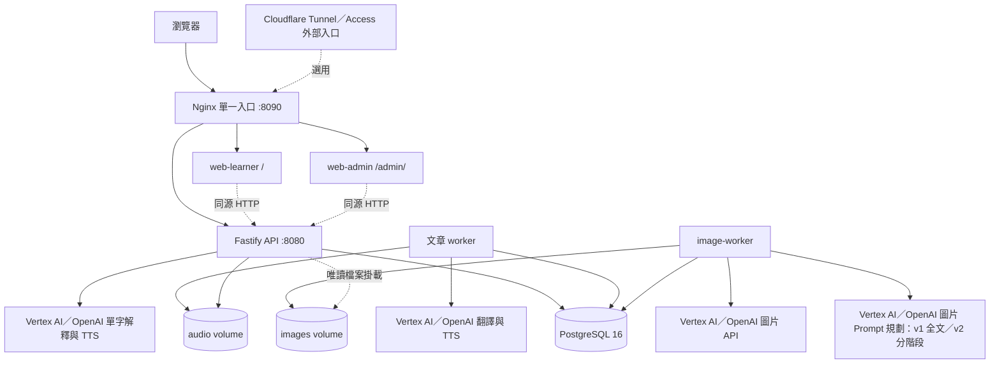
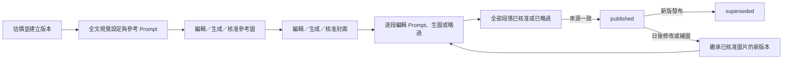

# 專案架構與功能導覽（以程式碼為準）

> 供新進 agent 與維護者先建立全貌，再依任務閱讀相關程式。
> 初始分析日期：2026-09-20；初始程式碼基準：`a1f32ea`；最近同步：2026-10-06（basic 英文解釋音檔完成接入）。本機正式 DB 已套用字庫 migration、匯入全部 9,166 詞條；basic 的 1,193 單字、4,108 英文例句與 3,591 英文解釋共 8,892 段 MP3 已完成，並複製至 audio volume、匯入 metadata。新版程式已在本機預覽，尚未部署新版服務，不代表網站已上線。舊圖片轉換 migration 已於 2026-09-27 套用正式 DB，相關程式碼的部署狀態仍另行確認。
> 本文由實際原始碼、SQL migrations、執行設定、腳本與測試整理；初始整理未使用 `docs` 內既有需求／設計文件，也未以 README 的功能敘述代替程式分析。後續同步會連結已確認的需求文件。這是現況快照，不是未來需求清單。遇到差異，以當下可執行程式與 migration 為準。

## 1. 先讀這裡：專案目的與全貌

這是一個面向繁體中文使用者的英文閱讀與聆聽平台。管理者整理英文教材，系統產生繁中翻譯與中英語音；學習者閱讀文章、聽朗讀、點選單字查閱語境解釋，也能透過經人工審核的插圖理解內容。從教材分類、圖片提示與 UI 可看出對學校教材及兒童學習情境的支援，但沒有以年齡限制使用者。

產品有兩個介面：**學習前台**與**管理後台**。後端由一個 API、文章 worker、圖片 worker 組成，共用 PostgreSQL；音檔與圖片存放在檔案 volume，DB 保存路徑及 metadata。

五條主流程：

1. **文章教材**：後台輸入標題／英文內文 → API 依空白行切段、建立 DB jobs → worker 翻譯與合成語音 → 前台閱讀、聆聽。
2. **語境單字**：點單字先讀既有解釋 → admin／reviewer 可用本篇脈絡產生解釋 → API 先回文字，再於 API 行程內背景補音檔 → 全站共用。
3. **收藏複習**：單字卡主動收藏 → 保存單字與來源快照 → 快速複習／自行判斷的快速挑戰 → 標熟悉後移出待複習，可重新收藏。
4. **文章插圖**：admin 估價並建立版本 → 文字模型提出視覺設定與可編輯 Prompt → 人工逐步生成、審核參考圖與封面 → 逐段生圖或略過 → 整版發布 → 前台顯示。
5. **字庫練習**：入口首頁選單字練習 → 選一套分級及精確級別 → API 隨機抽一個詞條及最多三個例句 → 單純練習、聽力或單字挑戰；不保存作答紀錄或建立收藏。

新 agent 必須先知道的邊界：

- `done` 是文章翻譯／語音流程的完成狀態，**不代表插圖已發布**；沒有插圖也能閱讀。
- 單字解釋與「已解釋」標記是全站共用資料，**不是個人背單字或學習進度**；主動收藏與熟悉狀態另存於 `vocabulary_items`／`vocabulary_sources`。
- 字庫 `wordbank_entries`／`wordbank_audio` 與文章單字、收藏分開，提供 JSON 匯入、離線產音、讀取 API 與獨立練習頁。字庫練習不改動既有收藏／複習。需求、準備狀態與操作入口見 `docs/wordbank-practice-requirements.md`。
- 文章 job、圖片 job、單字背景 TTS 是三種不同機制，不可直接套用同一套重試方式。
- 前後台各有本地型別與 API client；瀏覽器程式沒有直接依賴 `@el/shared`。
- API 沒有統一 `/api` 前綴，使用 `/articles`、`/words` 等頂層路徑，新增路徑要一起檢查反向代理。
- 正式呼叫 LLM／TTS／圖片供應商會產生費用；理解專案與一般測試不需要呼叫它們。

## 2. 架構與程式目錄

| 位置 | 責任與優先閱讀入口 |
| --- | --- |
| `package.json` | npm workspaces 與跨 workspace 指令；共五個 workspace |
| `api/src/server.ts` | 組裝正式 config、DB、LLM client、限流與圖片模型可用性；啟動 HTTP |
| `api/src/app.ts` | 可注入依賴的 Fastify 工廠；組裝 auth、路由、音檔服務、錯誤處理 |
| `api/src/routes/` | articles、lookups、vocabulary、wordbank、taxonomy、users、stats、illustrations 的 HTTP 邊界 |
| `worker/src/index.ts`、`processor.ts` | 文章 jobs 輪詢與處理流程 |
| `worker/src/image-index.ts` | 圖片服務獨立入口；和文章 worker 使用同一 Docker image，但為另一個行程／服務 |
| `shared/src/repo/` | 核心實體的參數化 SQL、查詢、camelCase 映射 |
| `shared/src/db.ts`、`config.ts`、`schemas.ts` | DB pool／交易、環境設定驗證、核心 Zod 契約 |
| `shared/src/llm/`、`generationSettings.ts`、`generationClients.ts` | Google／OpenAI 文字與語音 client、載入 config 模型清單／驗證及依工作設定建立 client |
| `shared/src/audioFiles.ts`、`audioEncode.ts` | 共用音檔寫入／刪除與 ffmpeg 編碼 |
| `shared/src/illustrations/` | 圖片契約、模型／價格目錄、版本與審核、佇列、供應商、檔案儲存 |
| `web-learner/src/` | React 學習前台；`App.tsx`、`LearningHome.tsx`、`WordbankPractice.tsx`、`useArticlePlayer.ts`、`AudioBar.tsx`、`Illustration.tsx` |
| `web-admin/src/` | React 後台；`App.tsx` 管主要頁面，`GenerationSettings.tsx` 管文字／語音／圖片三項生成設定，`AudioBackfillPanel.tsx` 管缺失音檔，`Illustrations.tsx` 管圖片生命週期 |
| `migrations/` | DB 結構的可執行演進；不能只讀初始 migration 判定現況 |
| `config/generation-models.json`、`image-models.json`、`image-pricing.json` | 共用文字／語音模型與聲線、圖檔模型與參數、圖片及規劃費率 |
| `docker-compose.yml`、各 Dockerfile | 部署服務、相依啟動順序、掛載、ports、healthcheck |
| `proxy/nginx.conf`、兩個前端 nginx／Vite 設定 | 正式與開發環境的路徑轉發 |
| `scripts/`、`fixtures/seed/` | 部署、備份、免 LLM 示範資料匯入 |
| `source/vocabulary-database.json`、`shared/src/{wordbank,wordbankAudio}.ts`、repo、`scripts/import-vocabulary*.ts`、`scripts/generate-wordbank-audio.mjs` | 9,166 字獨立字庫、補缺匯入、音檔 metadata 校驗、本機 Qwen3-TTS 批次生成 |
| `.github/workflows/ci.yml` | Node 20 CI：安裝、型別檢查、測試、前端 build、測試庫清理 |

技術組合：TypeScript、Node 20、Fastify 4、React 18、Vite 5、PostgreSQL 16、`pg`、Zod、Vitest；前端測試使用 happy-dom／Testing Library；圖片轉檔用 sharp，音訊轉檔用 ffmpeg。版本以各 `package.json` 與 lockfile 為準。

後端使用 `tsx` 直接執行 TypeScript；`@el/shared` 匯出 `src/index.ts`，沒有獨立的 shared 編譯產物。根目錄 `npm run build` 實際主要建置兩個前端，不會把 API／worker 編譯為另一套 JS dist。

## 3. 使用者與權限

依據：`api/src/auth.ts`、`api/src/routes/users.ts`、`shared/src/repo/users.ts`。

| 能力 | reader | reviewer | admin |
| --- | --- | --- | --- |
| 讀文章、既有單字解釋與已發布圖片 | 可 | 可 | 可 |
| 讀字庫級別、隨機單字與例句並練習 | 可 | 可 | 可 |
| 收藏、複習、熟悉狀態與取消收藏 | 可 | 可 | 可 |
| 以本篇脈絡產生單字解釋 | 不可 | 可 | 可 |
| 文章新增／修改 metadata／刪除／重試／重生 | 不可 | 不可 | 可 |
| 分類標籤異動、單字解釋刪除、補音檔 | 不可 | 不可 | 可 |
| 插圖估價／生成／審核／發布、查看草稿圖 | 不可 | 不可 | 可 |
| 讀寫生成供應商與模型設定 | 不可 | 不可 | 可 |
| 統計、使用者角色管理 | 不可 | 不可 | 可 |

`reviewer` 是單字內容產生權限；名稱不表示具有圖片審核權限。後台介面不是最終安全邊界，權限由 API `requireAdmin`／`requireReviewer` 判斷。

- 正常模式取 `Cf-Access-Jwt-Assertion`，使用 team domain 的 JWKS 驗簽、檢查 audience 並取 email；本專案沒有密碼登入／註冊／重設密碼流程。
- `DEV_AUTH_BYPASS` 開啟時，改用 `DEV_USER_EMAIL`。Compose 預設提供 bypass；這是開發預設，不代表正式環境應維持此設定。
- 每次受保護請求透過 `ensureUser` 建立使用者或更新 `last_seen_at`，不覆寫既有 DB 角色。
- `ADMIN_EMAILS` 優先決定有效 admin 身分；未命中時沿用 DB role。DB enum 仍容許 `admin`，因此不能宣稱程式在任何情況都只接受環境變數 admin。
- 管理 API 只能指派 `reader`／`reviewer`，支援預先建立 email；新建但尚未登入者的 `last_seen_at` 為 null。此操作不等於替 Cloudflare Access 設定通行名單。
- 應用層預設放行 `/healthz`、`/audio/` 路徑；`/images/*` 要驗證身分，非 admin 只能取目前發布版本選用的圖片。外部 Cloudflare Access 規則不在程式庫內，不能僅憑本機設定斷言線上保護情況。

## 4. 學習前台功能

依據：`web-learner/src/App.tsx`、`LearningHome.tsx`、`WordbankPractice.tsx`、`VocabularyReview.tsx`、`lib/`、`useArticlePlayer.ts`、`Illustration.tsx`。

### 入口首頁與獨立字庫練習

- 根路徑（空 hash）顯示首頁；「文章閱讀」開啟 `#/articles`，「單字練習」開啟 `#/practice`，「情境模擬」停用並標示即將推出。品牌按鈕回首頁，既有 `#/a/<id>` 與 `#/review` 仍有效；課文返回文章清單，從複習進入的課文返回複習頁。
- 字庫頁預設使用「字庫分級」及「全部」、模式為「單純練習」。一次選 `list`、`cefr` 或 `tw_7000` 一套制度，同套可多選精確級別及「未分類」，選 A2 不累計 A1。選「全部」會清除個別級別；取消最後一個級別會回到全部，切制度也重設全部。
- API 隨機抽一個符合範圍的詞條，保留同詞條全部詞性、中文定義與英文解釋，隨機取最多三個中英例句；未滿三句時全部顯示，不補造資料。下一字可再次抽中同字，不維護抽題歷史。
- 單純練習直接顯示完整內容。聽力揭曉前只露第一個字母，例句文字與解釋不放入 DOM，只提供可用的單字／例句音訊。挑戰揭曉前顯示全部非空英文解釋；滿四個 Unicode 字母露首尾，較短只露首字母，其他字元以圓點遮蔽。揭曉後顯示完整字詞、詞性、中文定義、英文解釋與中英例句。
- 缺文字顯示「待補」，缺音檔顯示「待準備」並停用朗讀；不觸發 LLM 或 TTS。播放失敗可重試，音訊與既有 audioBus 共用仲裁。切模式、篩選、下一字會停止音訊、重抽並重設揭曉；離頁也停止，舊請求取消後不覆蓋新結果。
- 字庫英文解釋也逐段提供朗讀：單純練習、挑戰提示及揭曉後可播；聽力揭曉前不顯示解釋或朗讀按鈕。basic 追加 3,591 段解釋已生成並接入，總音檔為 8,892；`data/wordbank-audio/explanation-completion.json` 狀態為 complete。
- 級別及抽題各有載入／錯誤／重試狀態，空範圍顯示調整級別提示。揭曉後焦點移至答案標題，揭曉前朗讀標籤不包含答案。頁面不保存成績、熟悉或收藏資料，不影響文章收藏／複習。

### 文章瀏覽與閱讀

- 清單僅顯示 `status === "done"` 的文章；API 本身仍回所有狀態的文章，詳情 API 也沒有以 done 限制讀取。
- 分為課業內 `school` 與課外 `extracurricular`；可依年級、單元、難度、分類及標籤篩選，搜尋只比對標題。多個標籤須全部符合（AND）。篩選在瀏覽器進行，選項由已載入文章萃取。
- 用 `#/a/<id>` 定位文章，支援瀏覽器上一頁／下一頁、來源文章跳轉與分享；分享優先呼叫系統分享，再退回複製連結。
- 各段英文拆成可點單字；逐段或一次展開／收合繁中翻譯，可播放中文朗讀。
- 文章卡片、閱讀頁與播放器顯示已發布封面；無圖或載入失敗時回退至既有漸層／emoji。段落圖缺失或失敗則省略。
- 圖片上的教學單字是 HTML 按鈕，依人工審核的 0–1 座標放置，可隱藏；點擊沿用單字查詢彈窗，不是燒在圖片中的文字。

### 音訊體驗

- 全文英文朗讀由多個段落音檔串接成虛擬時間軸，沒有生成一個全文合併音檔。
- 預載每段音訊 metadata 取得時長；支援跳段、進度拖曳、暫停續播、0.5／0.75／1／1.25／1.5／2 倍速與全文循環。
- 單段按鈕播放完即停；全文模式才自動接下一段，並跟隨目前段落捲動與高亮。
- 空白鍵播放／暫停、左右鍵切段；彈窗開啟或焦點在輸入／按鈕元件時不攔截。
- `lib/audioBus.ts` 協調全文播放器、中文朗讀與單字語音，開始新音源時暫停前一個。

### 單字彈窗

顯示全站該字的多篇來源解釋、中英解釋與例句、英文發音、片語 `headword`，可跳回來源文章及開啟 Google 圖片搜尋。例句與解釋使用相同文字樣式；只提供單字、英文解釋與英文例句的播放按鈕。admin／reviewer 額外看到「用本篇重新解釋」及後台單字連結；後台管理操作本身仍限 admin。

畫面標為「本篇已解釋」後不提供直接強制覆寫按鈕。單字卡提供主動收藏；開啟彈窗本身不收藏，沒有解釋仍能收藏，不呼叫 AI 產生內容。播放器位置與翻譯展開等主要保存在 React state，尚無持久化的閱讀進度。

### 收藏與複習

- `#/review` 開啟 `VocabularyReview.tsx`。同字合併呈現並保留多篇／多段來源，熟悉狀態作用於整個單字。
- 可同時篩選課業內／課外、單元、課文、年級、類別及收藏日期；來源條件必須由同一筆來源全部符合，分類採收藏時快照。篩選區可收合，收合後顯示目前範圍摘要，不清除條件。
- 收藏日期依 item 的 `savedAt` 換算 `Asia/Taipei` 日，區間含起迄日；來源日期僅供資訊。篩選存於 sessionStorage，回課文再返回複習可保留。
- 快速複習直接顯示原文與既有解釋，優先所選來源課文的解釋；快速挑戰先隱藏原文與答案，揭曉後自行選「記得／忘記」。每張卡片的熟悉狀態、下一個及取消收藏操作位於內容上方。記得或手動已熟悉將單字移出待複習，忘記保留並換下一張。
- `mastered` 紀錄保留且可重新收藏；取消收藏只刪收藏及其來源，不刪共用單字、解釋或課文。
- 回原文使用 `#/a/<id>?paragraph=<id>&word=<word>&from=review` 定位段落／標字；課文刪除後仍保留來源快照，但不提供返回該課文的按鈕。
- 複習音訊沿用 audioBus，提供單字與英文解釋、英文例句音訊；切換卡片／模式時停止音訊，挑戰揭曉狀態重設。API 載入或異動失敗會顯示錯誤，不先移除收藏。

## 5. 管理後台功能

依據：`web-admin/src/App.tsx`、`api.ts`、`lib/meta.ts`、`Illustrations.tsx`。

| 區域 | 已實作行為 |
| --- | --- |
| 文章清單 | 含所有處理狀態；標題／教材／分類標籤篩選；依畫面高度計算每頁筆數；前台閱讀連結；刪除 |
| 新增文章 | 表單貼入英文純文字與 metadata；不是 PDF／Word 檔案解析上傳 |
| metadata 編輯 | 標題、教材別、年級、單元、難度、分類、標籤；內文不在此修改 |
| 文章詳情 | 圖片／音檔／單字分頁，預設音檔；音檔頁保留各段原文、翻譯、狀態、最近 job 錯誤及中英音檔，可重試失敗段落與重生指定產物 |
| 分類／標籤 | 分類建立、改名、刪除；UI 提供母／子分類；標籤依 kind 分組，支援單項編輯及整組 kind 改名 |
| 單字管理 | 搜尋、展開來源解釋、刪單筆解釋或整個單字；支援進站 `#/w/<word>` 深連結 |
| 補缺音檔 | 文章清單按鈕切換到獨立的缺檔頁，與文章搜尋／篩選分開；一個待補音檔一列（單字發音跨來源只列一次、英文解釋、英文例句）。可逐檔補齊，或補齊完整清單並查看進度、失敗數；頁內搜尋只影響顯示，不縮小全部補檔範圍。可返回文章清單。舊批次 API 每次仍最多掃描 10 個單字與 10 筆解釋 |
| 使用者 | 列表、最後出現時間、reader／reviewer 指派及預先指派 |
| 統計 | 文章／段落／文章 jobs 狀態數、單字／解釋數、當日受限流計數；不是個人學習分析 |
| AI 圖片 | 以單一建立按鈕自動估價並建立版本、選擇版本、分階段 Prompt 編輯與逐張生成、候選圖實際 Prompt、圖片與教學詞位置審核、段落略過／日後補圖、取消／刪除／發布 |
| 生成設定 | 文字、語音、圖片各自選 Google／OpenAI 與模型；文字共用於翻譯、單字解釋與圖片 Prompt 規劃（舊版全文、新版分階段），語音可選中英文聲線。顯示憑證可用狀態，儲存採版本檢查 |

文章列表與詳情每 3 秒輪詢，統計每 5 秒，圖片面板每 3 秒。沒有 WebSocket／SSE。後台主要用 `view` state 換頁，沒有完整的 React Router 路由表。

圖片候選排程中或生成中時，候選卡顯示等待提示與讀取狀態；若前次請求失敗但已排定自動重試，提示原因並將詳細錯誤收在可展開區。圖片工作尚未完成時，該步驟的生圖按鈕停用，避免重複建立候選；輪詢取得可審核圖片後恢復操作。

文章詳情把返回清單、標題與狀態排在同一標題列。圖片版本的失敗請求以摘要呈現，詳細紀錄預設收合；管理者可清除目前已顯示的失敗提示，之後的新失敗仍會出現。清除進度記在 `illustration_audit_events`，原始 `illustration_attempts`、候選狀態與費用資料不刪除；結果不明的請求另行顯示。圖片介面的 Prompt 用語在畫面上統一寫作「提示詞」，API／DB 欄位名稱維持不變。

後台的刪除文章／分類／單字／解釋、段落重生、缺檔補音，以及圖片工作操作，點擊按鈕後直接送出，不再跳瀏覽器二次確認。分類／標籤改名、舊版圖片略過原因與圖片拒絕原因使用文字輸入視窗；圖片核准不另設內容確認勾選或審核原因欄位。

## 6. 文章處理資料流與狀態

入口：`api/src/routes/articles.ts` → `shared/src/repo/{articles,paragraphs,jobs}.ts` → `worker/src/processor.ts`。

1. `POST /articles` 驗證 JSON，`splitParagraphs` 以空白行切段並去除空段。
2. 同一 DB transaction 讀取生成設定，建立文章、分類／標籤關聯、依序 `idx` 的段落，以及每段一個帶翻譯與音檔設定快照的 job；回 `202 { id }`，不等待 AI 完成。
3. worker 用 `claimNextJob` 原子認領一筆到期 pending job，或回收超過期限的 processing job；使用 `FOR UPDATE SKIP LOCKED`，認領時增加 attempts。
4. 缺翻譯且同篇有多個缺譯段落、其翻譯模型快照相同時，先嘗試批次翻譯；批次失敗或快照不同時回退逐段。已有翻譯沿用。
5. 缺英文／中文音檔才呼叫 TTS；同段的兩種語言並行。檔案在 DB transaction 外寫入。
6. 成功後以 transaction 更新段落與 job 為 done，重算文章狀態。

文章重算規則：尚有 pending／processing 段落 → processing；否則有 failed → failed；否則 done。雖然共用 enum 包含 processing，現有處理器認領時主要更新 job，並未同步把段落設為 processing；不要假設三張表每一刻狀態一致。

失敗未達上限時退回 pending，以 `available_at` 延遲；預設最多 3 次嘗試，退避 `30 × 2^(attempts−1)` 秒、上限 900 秒。stale 預設 5 分鐘，poll 間隔預設 3 秒；每輪 drain 完成才排下一輪。

手動處理：

- 整篇 retry 只重設 failed 段落／jobs，attempts 歸零、立即可取，文章設為 processing。
- 自動重試與整篇 failed retry 沿用原 job 設定快照；單段手動重生改取當下生成設定。遷移前沒有快照的舊 job 在處理時取當下設定。
- `scope=translation` 清翻譯及中文音檔，保留英文音檔。
- `scope=audio-en` 或 `audio-zh` 只清指定音檔；worker 依 null 欄位決定重做內容。
- 刪文章由 DB cascade 清段落、jobs、文章解釋與圖片版本等；API 盡力刪文章／解釋音檔目錄，保留跨文章共用單字發音。圖片檔案由獨立 cleanup queue 處理。

LLM 層另有短期重試與 HTTP timeout；它和 DB job 重試是兩層，不能把 attempts 當作實際供應商呼叫次數。一般 Gemini 請求 timeout 預設 60 秒；429／RESOURCE_EXHAUSTED 與不可重試的 HTTP 4xx 在 LLM 層快速失敗，交由上層處理。Vertex AI 語音請求明確帶 `contents.role = "user"`。

## 7. 語境單字資料流

入口：`api/src/routes/lookups.ts` → `shared/src/llm/explainWord.ts` 與 `shared/src/repo/wordExplanations.ts`。

1. 點字先 `GET /words/:word/explanations`，此讀取不觸發 LLM。
2. admin／reviewer 才能 `POST /lookups`，帶 `{ articleId, paragraphId, word }`。
3. `normalizeWord` 只 trim＋轉小寫，**不做詞形還原**；`run` 與 `running` 是不同 key。
4. `words` 全站唯一；解釋唯一鍵是 `(word_id, article_id)`，不是 paragraph 或 user。paragraph 提供首次生成的上下文。
5. 快取命中直接回既有結果，不消耗本次限流額度、不重生音訊。「重新解釋」表示換本篇語境，並非強制覆寫本篇快取。
6. 未命中先通過 per-user 每分鐘與全站每日限額，預設 10／200，再讀取當下單字解釋與音檔設定，產生五種文字內容及 `headword`。
7. 先存文字、回 `201`；API 行程以 fire-and-forget 補單字英文發音、英文解釋與英文例句音檔。中文內容只存文字，不再產生或補齊中文音檔。各 TTS 失敗可留下 null，文字仍可使用。
8. 前台提交後每 5 秒重抓、最多 4 次；admin 可由缺檔清單逐檔或全部補齊。清單與單檔操作執行時重新檢查缺漏，全部補檔由前台依清單逐列呼叫 API，避免單次請求過長；遇供應商 429 配額限制會等待 60 秒後重試同一筆，若仍受限就停止並保留剩餘清單。其他失敗項保留供重試。並行首查時靠唯一鍵避免重複資料，衝突請求回既有解釋；不保證首查併發只打一次 LLM。

五組文字內容是：英文解釋、英文例句、繁中翻譯、中文解釋、中文例句。資料庫仍保留舊中文音檔欄位與檔案以相容既有資料，前台不播放；無需清理正式庫。`headword` 可以是原文片語，但快取 key 仍為使用者點的 normalized word。

`GET /articles/:id/lookups` 的意思是「本篇出現、且全站任何來源已有解釋的字」；不是「本篇產生的解釋」或「我查過的字」。後台 `/articles/:id/explanations` 才列出本篇來源的解釋。

限流資料只存在單一 API 行程記憶體，重啟歸零，按伺服器本地日期換日。統計 `lookupsToday.llmCalls` 是放行次數，並不是含所有重試／TTS／圖片的完整 API 費用帳。

### 收藏資料流

入口：`api/src/routes/vocabulary.ts` → `shared/src/repo/vocabulary.ts`。沿用登入身分，reader 亦可操作自己的收藏；服務端取 `request.user.id`，不接受任意 owner。

`POST /vocabulary` 驗證文章與段落歸屬，再以交易儲存正規化字面與文章標題、原文、分類快照。既有 active 字加入來源不改 item 收藏日期；mastered 字從課文重新收藏會恢復 active，更新 item 與指定來源日期。`PATCH /vocabulary/:id` 從 mastered 恢復 active 時只更新 item 日期，保留來源原日期。重複收藏同一 active 來源不更新快照／日期；收藏異動透過 owner row lock 序列化。

## 8. 圖片子系統

入口：`web-admin/src/Illustrations.tsx` → `api/src/routes/illustrations.ts` → `shared/src/illustrations/` → `worker/src/image-index.ts`。

### 模型、估價與版本

- `catalog.ts` 驗證模型 provider、adapter、用途參數及對應價格；設定從兩個 JSON 載入，沒有線上自動查價。
- 程式庫目前設定包含 OpenAI 與 Gemini 圖片模型；後台生成設定決定圖檔模型與 Google／OpenAI 圖片 Prompt 規劃模型。估價與生成版本保存模型及規劃器快照。這只描述 repo 設定，不代表已驗證供應商當日型號、價格或線上可用性。
- image-worker 每 15 秒在 DB 宣告模型 ID／設定 hash；API 僅列出最近 60 秒心跳且 hash 相符的模型。
- 圖片入口要求文章 done、1–200 段；新 run 的 scope 仍只接受 `{ kind: "all" }`，段落是否實際生圖由版本內的逐段操作決定。
- estimate 保存來源／模型／價格 hash 及 snapshot，10 分鐘有效，綁文章與建立者。整篇預估以每段各生圖一次為參考，包含必做的參考圖、封面及分階段文字規劃；略過段落不會送出生圖請求。預設最高預算為基礎估價兩倍，目前上限 USD 100。
- 金額以 `usd_micros` 整數保存（1 USD = 1,000,000 micros）。估價是程式內預算依據，不是供應商帳單保證。
- 建 run 再核對來源與設定、消耗 estimate，使用 idempotency key 防重複建立，保存 revision 與當時所有設定。新版本使用 `workflow_version=2`。`1789862400006_import-legacy-illustrations.sql` 將既有 v1 版本原地轉入 v2，並以 `legacy_imported` 標記；若仍有 v1 工作在等待或執行，migration 會拒絕套用，須先處理工作狀態。

### 規劃、生成、審核、發布

這是全新版本的主要成功路徑；取消、重試、結果不明另由狀態守衛處理。已發布版本不原地修改；所有已發布或被取代的版本都在版本下拉右側顯示「修改圖片」，按下後建立承接已核准圖片的新 revision，可修改承接的封面／段落圖片或補先前略過的段落，完成後再整版發布。已核准的參考圖仍鎖定；若須重做參考圖，應另建全新圖片版本。轉入的舊版若沒有已核准參考圖，補圖版本將參考圖視為可選，可直接補段落；不會自動安排參考圖規劃或生圖。承接的候選圖保留原模型快照與檔案，新補圖片使用新版本選定的模型，兩者可能有風格差異。

管理後台圖片版本使用同一套分階段 UI。migration 從舊版已保存的候選圖取回實際 Prompt 與替代文字；沒有資料就留空，既有圖片、審核、發布與費用紀錄原地保留。全文規劃未完成而缺少 slot 的版本，依來源建立空白封面及段落 slot。從未建立參考 slot 的轉入版補可選的空白 slot；曾有但未核准的參考圖則保留歷史候選與 Prompt，並將參考圖設為可選。兩者都不會自動觸發供應商請求。導覽的已核准狀態與解鎖依目前選用候選圖判定。

- 全新 v2 版本建立後只排參考圖的文字規劃；承接已發布版本補圖時沿用既有已核准參考圖，若舊版沒有已核准參考圖則將該欄設為可選，保留已有歷史資料。規劃 Prompt 要求文字模型從全文辨識需要跨圖保持一致的多個故事主體，可為人物、動物、建物、地點或其組合；逐一記錄人物的年齡、髮型、膚色、表情、穿著、體型，動物的物種、大小、毛色與斑紋，建物的形狀、材質與建築細節，地點的地形、布局與固定地標，以及共用畫風。單張參考圖以分開的中性視覺研究呈現這些主體，不在圖片中加入文字標籤，也不把故事動作或暫時道具固定在參考圖或視覺設定；若主體是建物或地點，可用簡單環境呈現其固定特徵。沒有反覆出現的角色時依文章核心主體建立參考設定，不虛構人物或事件。封面與段落規劃依各自場景取用相關主體的穩定特徵與畫風，動作與場景由文章內容決定。全新版本仍須製作一張參考圖。管理者可修改視覺設定與 Prompt。新版本參考圖核准後才可要求封面 Prompt；轉入的舊版若缺已核准參考圖，可直接規劃封面及段落。文字規劃與生圖是不同的明確操作，未按生圖不建立該圖片 job。既有已核准參考圖不會因規劃指示更新而自動重做。
- `illustration_slots` 保存目前可編輯的 Prompt 草稿與修訂號；每張候選圖的 `prompt_json` 固定記錄該候選生成工作所用的最終 Prompt，不另存 LLM 初稿或編輯歷史。後台輪詢不應覆蓋正在編輯的草稿。逐次估價可查文字規劃／目前 Prompt 生圖的預估費用與版本剩餘預算；建立版本、產生／重新建議 Prompt、生圖、取消、發布、刪除、舊版重新生成與略過段落都由按鈕直接送出，不彈出瀏覽器二次確認。
- 每段可直接標記「已略過」而不輸入原因，也可在草稿版本中回來補圖。發布時全新版本的參考圖及所有版本的封面必須核准，每段須已核准或已明確略過；轉入版本可保留缺少的參考圖。無圖段落在學習前台省略圖片。
- 下列舊版全文規劃契約只用於解讀轉入前的歷史資料；新流程不會在規劃完成時一次排入封面與所有段落生圖工作。

- 舊版 planner 一次產出全文摘要、風格／角色設定、封面 brief，以及完整段落計畫；檢查 ID／idx 與原文一致，教學詞必須是原文完整 token，每段至多 3 個。
- 規劃回應的教學詞由程式計算 `normalizedWord`，逐筆核對原文（含大小寫）後，依正規化單字合併重複項目並保留第一筆，合併後仍須符合每段至多 3 個的限制。不猜測單複數或改寫原文字詞；詞組或不符合原文的教學詞會略過，全部略過時仍可用空標籤清單繼續產圖，原因存於 `plan_json.validationWarnings`，並依圖片頁目前選取的版本在文章詳情「單字」頁籤的「教學單字調整」顯示。提示包含段落 ID、教學詞位置與可安全顯示的錯字，異常字元僅顯示位置；核心規劃結構、其他標籤欄位格式、數量上限與人工審核仍採嚴格驗證。
- Gemini 規劃請求的 JSON Schema 僅約束欄位、型別與必填結構，避免巢狀陣列長度及數值上下界造成供應商 `too many states` 拒絕；數量限制由 prompt 提示，回應仍經 `contracts.ts` 的 Zod 與原文一致性驗證後才可生成圖片。
- 轉入前的舊版只有 recurring characters 才建立 reference slot；migration 會替缺少者建立可選的空白 slot。全新版本每篇都建立必做的 reference slot，後續 job 不會提前建立。
- 每次供應商工作在 run lock 下預留預算，並記錄 attempt、lease token、prompt／request fingerprint、usage 與計費狀態。
- `providers.ts` 隔離 OpenAI Images 與 Gemini transport；有參考圖時 OpenAI 使用 edits。內部冪等 key 不等於供應商保證不重複計費。
- 圖片回來後 sharp 產生 master、web；封面另有 card 640×360、hero 1280×720、player 160×160。段落 web 保持完整構圖，單字座標以此為準。
- 管理者審核 alt text、內容／安全、教學詞位置；段落圖可從該版本保存的原文選字，填寫圖中物件與學習說明後新增標籤（每圖最多 3 個、不重複，移除後可再加）。新增標籤須點圖或輸入 X／Y 完成定位，再以「核准並選用」儲存，不重新產圖；核准按鈕須有替代文字，且所有教學詞已定位。封面、參考圖、不可審核的候選與唯讀版本不提供新增；沒有原文快照也不提供新增。伺服器已存內容未變時，輪詢保留尚未儲存的審核草稿；候選身分或版本改變時重設。拒絕時才要求原因；新版參考圖核准後若要更換，須建立新版本。
- 只可略過段落 slot；不要求使用者填原因。封面不能略過。發布要求 run 在 review、來源 hash 未變、必要圖皆已核准且有 alt text／asset；段落須已核准或明確略過。轉入版的空白可選參考圖不妨礙發布。
- 發布以 transaction 切換 `article_visual_publications`，前一版標為 superseded；前台只拿發布資料，不接收草稿 prompt、模型成本或候選歷史。
- 已發布／被取代／取消版本不可原地編輯；新版生成期間舊發布版仍可閱讀。

### 故障與儲存

明確可重試的 provider 錯誤有有限重試與退避；網路中斷或已送出但結果未知時標為 `uncertain`，保留可能費用、不自動重送。後台顯示最近一筆結果不明請求的操作、模型與結束時間；起訖紀錄相差至少一分鐘時另顯示約略經過時間，舊請求收在詳細紀錄中。Prompt 規劃與圖片生成分別說明未取得的結果及後續操作；若後續已取得 Prompt，提示可直接檢查並繼續。供應商是否完成舊請求或計費仍無法從本系統確認。job 每 15 秒續期，超過 10 分鐘沒有更新的 processing job 由 recovery 保守標為 uncertain。同一 slot 再次規劃時，若有歷史 `uncertain` 規劃工作；同一 slot 生圖時，若有任一歷史 `uncertain` 工作，前端會自動附上 `acceptUnknownCharge` 費用風險旗標，與後端的拒絕條件一致；不另彈二次確認。

`LocalImageStorage` 把檔案寫到 `articles/<articleId>/runs/<runId>/<assetUuid>/`，API 將 images volume 唯讀掛載。刪版本／文章透過 DB trigger 釋放無引用 asset，將檔案加入 `illustration_cleanup_jobs`；image-worker 執行實體清理並重試。圖片 worker 沒開時，即使 DB 刪除完成，檔案清理仍可能等待。

schema 保留 `derive`／`qa` job kind 等欄位，但目前主流程實際排程的是 `plan`／`generate`；不能僅看到 enum 就宣稱有獨立自動 QA 或衍生圖 pipeline。

## 9. 資料模型與契約

依據：`migrations/*.sql`、`shared/src/schemas.ts`、`shared/src/repo/`、`shared/src/illustrations/repository.ts`。

| 資料群 | 表與關係 |
| --- | --- |
| 使用者 | `users`：email unique，role、last_seen_at；文章／圖片建立及審核者引用 user |
| 教材 | `articles` 一對多 `paragraphs`；段落 `(article_id, idx)` unique；`jobs` 引用 article 與 paragraph |
| 生成設定 | `generation_settings` 單筆保存文字、語音、圖片三項設定與版本；`jobs.generation_snapshot` 保存文章翻譯／音檔在建立時的選擇，舊快照仍可沿用 |
| 分類 | `categories.parent_id` 自我參照樹；文章至多一個 category，刪分類時文章關聯 SET NULL，子分類 CASCADE |
| 標籤 | `tags(kind,label)` unique；`article_tags` 多對多 |
| 單字 | `words.normalized_word` unique；`word_explanations(word_id,article_id)` unique，保存 paragraph 脈絡及五組產物 |
| 收藏 | `vocabulary_items(user_id,word)` unique，保存 active／mastered 與 saved_at；`vocabulary_sources` 保存來源／分類快照，來源 unique `(item_id,article_id,paragraph_id)`；文章／段落刪除時 FK SET NULL，收藏刪除時來源 CASCADE；不依賴共用 words FK |
| 獨立字庫 | `wordbank_entries.guid` UUID 主鍵，保存來源 id、word、詞性、定義、例句／解釋 JSONB、level 三套分級、category／scenario；匯入保留後補內容，只填缺漏、合併陣列，不刪既有詞條 |
| 字庫音檔 | `wordbank_audio.asset_guid` UUID 主鍵，引用詞條 GUID；kind 為 word／example／explanation，保存相對路徑、模型／聲線／語氣、文字 hash、時長、大小及生成時間。英文解釋使用 explains[].guid；匯入前核對 GUID 所屬詞條與當下文字 hash |
| 圖片估價／版本 | `illustration_estimates`、`article_visual_runs`、`article_visual_publications`；每篇只有一個目前發布指標 |
| 圖片內容 | `illustration_slots` 表示 cover／paragraph／reference；新版 slot 保存可編輯 Prompt 草稿及修訂號，每 slot 多個 candidates，candidate 保存當次實際生圖 Prompt，selected candidate 有歸屬約束 |
| 圖片檔案 | `illustration_assets` 與 `illustration_asset_files` 一對多；variant、object key、尺寸、MIME、bytes |
| 圖片執行紀錄 | `illustration_jobs`、`illustration_attempts`、`illustration_audit_events`、`image_worker_heartbeats`、`illustration_cleanup_jobs` |

補充契約：

- `week`、`page` 存在 DB／核心 Article schema，新增 API 可接收；目前管理表單與 metadata PATCH 並未完整提供此兩欄操作。
- DB categories 可表達多層樹，後台選擇 UI 主要為兩層；不要把 UI 層數誤當 DB 限制。
- 核心 repo 將 snake_case／BIGINT／timestamp 映射為 camelCase／number／ISO 字串。圖片管理 API 大量直接返回 DB row，含 snake_case，前端亦以對應型別處理；整個 API 並非完全統一 DTO 命名。
- `schemas.ts` 不涵蓋每個實際 HTTP payload：如 `POST /lookups` 回單筆 `explanation`，GET 則回 `explanations`；圖片、category、tags 等也有額外 DTO。改契約要同看路由及兩端本地型別。
- DB 音檔欄位存相對路徑：`articles/<id>/p<idx>.en|zh.<ext>`、`words/<id>/en.<ext>`、`words/<id>/a<articleId>/<content>.<ext>`。
- 新音檔預設 AAC/M4A；ffmpeg 不可用或失敗回退 WAV，既有 WAV 可共存，前端應使用 API 提供的實際路徑。
- 字庫離線音檔另採 Qwen3-TTS MP3，路徑為 `wordbank/<profileHash>/<assetGuid>.mp3`。生成器預設寫本機 `data/wordbank-audio/`，正式 audio volume 的檔案複製與 DB metadata 匯入為另一步，不會自動把本機路徑當作 API 音檔。
- 字庫讀取 API 只在 metadata 的文字 SHA-256 與當下單字／例句／英文解釋相同、相對路徑符合字庫 MP3 格式時提供音訊 URL；文字改過而錄音尚未更新時回 null。這不等同每次讀取都檢查實體檔案，檔案遺失會走前台播放失敗提示。

## 10. API 查找表

以下省略逐欄 JSON 規格，以對應路由檔內 validator 為準。一般讀取仍須驗證身分。

| 路由 | 權限／用途 | 原始碼 |
| --- | --- | --- |
| `GET /healthz`、`GET /me` | 健康檢查公開；目前身分需驗證 | `api/src/app.ts` |
| `GET /audio/*` | 應用層公開音檔 | `api/src/static.ts` |
| `GET /articles`、`GET /articles/:id` | 文章清單／詳情，附已發布圖片 | `api/src/routes/articles.ts` |
| `POST /articles`、`PATCH /articles/:id`、`DELETE /articles/:id` | admin 文章管理 | 同上 |
| `POST /articles/:id/retry`、`POST /articles/:id/paragraphs/:pid/regenerate` | admin 重試／指定產物重生 | 同上 |
| `GET /words/:word/explanations`、`GET /articles/:id/lookups` | 既有解釋／全站已解釋字標記 | `api/src/routes/lookups.ts` |
| `GET/POST /vocabulary`、`PATCH/DELETE /vocabulary/:id` | 已登入使用者列出／收藏／改熟悉狀態／取消收藏；不產生 AI 內容 | `api/src/routes/vocabulary.ts` |
| `GET /wordbank/options`、`GET /wordbank/random` | 已登入使用者取得三套分級數量／隨機詞條及最多三例句；不產生 AI 內容或寫入收藏 | `api/src/routes/wordbank.ts`、`shared/src/repo/wordbankPractice.ts` |
| `POST /lookups` | admin／reviewer 語境解釋 | `api/src/routes/lookups.ts` |
| `GET /words`、`GET /articles/:id/explanations` | admin 搜尋／文章來源解釋 | 同上 |
| `DELETE /words/:id`、`DELETE /explanations/:id`、`GET /lookups/missing-audio`、`POST /lookups/backfill-audio` | admin 刪除／列出缺檔／補音檔；POST 帶 `{kind,id}` 補單檔，無 body 沿用舊批次模式 | 同上 |
| `GET/POST /categories`、`PATCH/DELETE /categories/:id` | 讀取需登入；異動限 admin | `api/src/routes/taxonomy.ts` |
| `GET/POST /tags`、`PATCH/DELETE /tags/:id`、`POST /tag-kinds/rename` | 同上 | 同上 |
| `GET/POST /users`、`PUT /users/:email/role` | admin 使用者管理 | `api/src/routes/users.ts` |
| `GET /stats` | admin 統計 | `api/src/routes/stats.ts` |
| `GET/PUT /generation-settings` | admin 讀取可選模型、憑證狀態及更新三項設定；PUT 帶版本避免覆寫 | `api/src/routes/generationSettings.ts` |
| `GET /image-models`、`POST /articles/:id/illustration-estimates` | admin 可用模型／估價 | `api/src/routes/illustrations.ts` |
| `GET/POST /articles/:id/illustration-runs` | admin 版本列表／建立 | 同上 |
| `GET/DELETE /articles/:id/illustration-runs/:runId` | admin 詳情／刪除 | 同上 |
| `POST .../:runId/dismiss-failures` | admin 清除目前已顯示的失敗提示，保留請求紀錄與費用 | 同上 |
| `POST .../:runId/fork`、`PUT .../:runId/visual-bible` | admin 承接已發布或被取代版本的圖片供修改／補圖，或編輯參考圖前的視覺設定 | 同上 |
| `POST .../:runId/slots/:slotId/quote`、`POST .../plan`、`PUT .../prompt`、`POST .../generate` | admin 查本次費用、產生分階段 Prompt、保存草稿及手動生圖 | 同上 |
| `POST .../:runId/cancel`、`POST .../:runId/publish` | admin 取消／發布 | 同上 |
| `POST .../:runId/candidates/:candidateId/review` | admin 候選審核 | 同上 |
| `POST .../:runId/slots/:slotId/regenerate`、`POST .../:runId/slots/:slotId/skip` | admin 重生／略過 | 同上 |
| `GET /images/*` | admin 可讀草稿；其他身分限目前發布的選用圖 | 同上 |

圖片路由只在 `buildApp` 提供 illustrations dependencies 時掛載；正式 `server.ts` 由 `IMAGE_MODELS_FILE` 決定是否載入 catalog。POST lookup／backfill 也需要 lookup dependencies；這是可測試組裝方式，不代表正式 server 預設缺少它們。

字庫 options 不接收 query，回 `{ total, systems }`，每套含全部、固定級別及未分類的筆數（零筆也保留）。random 接收 `system=all|list|cefr|tw_7000`（預設 all）及逗號分隔的 `levels`；省略 levels 或 `levels=all` 不篩選，指定級別須與一套制度相符，同套多值採 OR，`unclassified` 對應 null。回 `{ poolSize, entry }`，空池是 200／entry null，非法參數或額外 query 是 400。兩路徑沿用一般身分驗證，不需管理者角色。單次查詢只回一詞條，不將全字庫載入瀏覽器；proxy、learner nginx 與 learner Vite 均轉發 `/wordbank`。

## 11. 執行、部署與測試

### 服務拓撲與設定

Compose 先啟動 DB，migrate 成功後啟動 API／worker，再啟動兩個前端。主入口預設 `8090`；API 綁 `127.0.0.1:8080`，DB 綁 `127.0.0.1:5432`，兩前端另開 `8081`／`8082`。Vite dev 預設為 admin `5173`、learner `5174`。

本次首頁與字庫驗收使用 learner `http://127.0.0.1:5174`、API `http://127.0.0.1:8180`；`api/src/preview.ts` 組裝既有 auth 與讀取路由，但不注入真實 LLM／TTS／圖片 client，也不啟動 worker。learner Vite 的 API 目標可由 `VITE_API_PROXY` 設定。這是本機預覽，沒有部署新版正式服務。

- 環境設定由 `shared/src/config.ts` 讀取：DB、音檔、選用供應商的憑證、Access、admin emails、lookup limits、音訊格式、圖片路徑及 catalog。Google 與 OpenAI 憑證可擇一或並存。Google 各工作共用 Vertex AI `generateContent`，`GOOGLE_CLOUD_PROJECT` 與 `GOOGLE_CLOUD_LOCATION` 組成端點；`global` 使用 `aiplatform.googleapis.com`。授權優先使用可呼叫 Agent Platform API 的 `GEMINI_API_KEY`，其次使用 `GOOGLE_APPLICATION_CREDENTIALS` 指定的 ADC；無憑證時不列為可用供應商。
- 文字、語音、圖片三項生成設定存於 DB `generation_settings`，由 admin 的 `/generation-settings` 讀寫。共用文字設定供翻譯、單字解釋與圖片分階段 Prompt 規劃使用；可選文字／語音模型與聲線由 `config/generation-models.json` 載入，圖檔模型由 `config/image-models.json` 載入。圖片與規劃費率由 `config/image-pricing.json` 定義，新增文字模型須有規劃費率才可儲存。設定檔在後端行程啟動時讀取，修改後需重啟相關服務；既有工作快照不會自動變更。舊五項設定升級時以「文章翻譯」模型作為共用文字模型。Vertex AI TTS 使用 `gemini-2.5-flash-tts`／`gemini-2.5-pro-tts`；migration 更新目前後台設定中的舊 preview 型號，舊 job 快照在送出時映射，已生成音檔不重做。
- 文字選項包含 Vertex AI `gemini-3.8-flash`，圖片規劃對此模型使用 `thinkingLevel=LOW`；其規劃費率目前採官方截至 2026-12-31 的優惠價，2027-01-01 須更新價格。`gemini-3.8-flash-lite-tts` 未列入 Vertex AI `global` 可用模型清單，因此語音選項尚未加入它。
- `VITE_*` 是前端建置設定。Compose 用 `LEARNER_URL_PUBLIC`／`ADMIN_URL_PUBLIC` 轉為 build args；改連結通常要重新 build，不能只重啟舊前端映像。
- 裸 `docker compose up` 不會啟用 images profile；**`scripts/deploy.sh` 預設加 `--profile images`**，因此完整部署包含 image-worker。tunnel、seed 仍各自為選用 profile。
- proxy 以 `proxy/` 目錄掛載 nginx 設定，避免單檔掛載在原子替換後指向已刪除 inode；從舊版單檔掛載升級需只重建 proxy 容器，單純 restart 不會更新掛載。
- 三個後端服務以 `config/` 目錄掛載模型與價格清單，避免編輯器原子替換 JSON 後容器仍讀到舊 inode；從單檔掛載升級需重建相關容器，之後修改清單重啟服務即可讀取。
- image-worker 至少要有一種可用圖片供應商憑證；只宣告可執行的模型。選定的圖片規劃供應商也要有對應憑證，否則該工作會失敗；開啟 profile 就可能開始處理既有待辦。
- `/healthz` 只回 API 存活，不查 DB／供應商；文章 worker healthcheck 看 heartbeat 檔，image-worker 的容器 healthcheck 被停用，另以 DB 心跳判斷模型可用性。不能把容器 healthy 等同所有業務流程正常。
- `scripts/backup.sh` 實際備份 DB custom dump、audio.tgz、images.tgz，預設保留最近 7 份；檔頭註解未完整反映圖片備份，應以執行段落為準。

### 常用指令及作用

| 指令 | 作用／注意事項 |
| --- | --- |
| `npm ci` | 按 lockfile 安裝 workspaces |
| `npm run typecheck` | 各 workspace `tsc --noEmit` |
| `npm test` | pretest 啟動獨立測試 DB、套 migration，再執行 workspace tests |
| `npm run test:db:down` | 移除測試堆疊與測試 volume |
| `npm run build` | 執行有 build script 的 workspaces，目前主要是兩前端 |
| `./scripts/deploy.sh up` | 建置、啟動、等 healthy／running，重讀 proxy 設定；會啟用圖片服務 |
| `./scripts/deploy.sh status` | 查看部署服務狀態 |
| `npm run seed` | 由 fixtures 匯入既有翻譯／音檔，不呼叫 LLM；會刪除並重建同標題示範文章 |
| `npm run vocabulary:import -- --dry-run` | 檢查全字庫，不連 DB；實際匯入需明示 DATABASE_URL，正式庫須先授權 |
| `npm run vocabulary:audio:generate -- --dry-run --list basic` | 列出單字＋全部英文例句產音計畫，不呼叫 TTS；真實生成需 WORD_BANK_REAL_TTS=1 加 --generate，支援續跑 |
| `npm run vocabulary:audio:import -- data/wordbank-audio/manifest.json` | 核對 GUID／文字 hash 後匯入 metadata；不複製檔案，需明示 DATABASE_URL |
| `npm run vocabulary:audio:test` | Node 原生測試批次工具，HTTP 假回應；不呼叫真實 TTS |
| `./scripts/backup.sh` | 備份 DB／音檔／圖片並輪替 |

seed 不是純新增或唯讀檢查，重跑可能更換文章 ID 並 cascade 清關聯；不要為了看畫面就對已有資料庫隨意執行。`deploy.sh clean` 會移除正式 volumes，不是一般測試清理指令。

### 測試地圖

- `shared/src/testing.ts` 只讀 `TEST_DATABASE_URL`，忽略正式 `DATABASE_URL`，要求 DB 名稱以 `_test` 結尾；預設 `localhost:5433/english_learning_test`。
- `docker-compose.test.yml` 使用獨立 project name、PostgreSQL tmpfs。DB 整合測試會 TRUNCATE；共用 DB 的測試不要自行改成跨檔／跨執行器並行。
- `shared/src/**/*.test.ts`：設定、核心契約、DB／repo、斷詞、音檔、LLM JSON／重試、圖片 catalog／plan／provider。
- `api/src/routes/*.test.ts`、`auth.test.ts`：以 Fastify inject、測試 DB、fake client 驗證權限、CRUD、快取、TTS 背景補齊、圖片全生命週期。
- `worker/src/processor.test.ts`：批次翻譯／回退、部分重生、退避、stale 回收、狀態聚合。
- 前端 `*.test.ts(x)`：純函式、路由、分享、音源仲裁、播放器、圖片 fallback／單字操作、後台錯誤與圖片審核操作。
- 收藏測試：`api/src/routes/vocabulary.test.ts` 驗證 CRUD、日期／來源語意及權限；`web-learner/src/VocabularyReview.test.tsx` 驗證篩選、挑戰、失敗保留、來源失效與音訊停止；App 與 route 測試涵蓋收藏入口及返回定位。
- 字庫測試：`shared/src/wordbank.test.ts`、`repo/wordbank.test.ts` 涵蓋來源校驗、全 9,166 字匯入／重匯、後補資料保留、分級精確匹配與音檔 GUID／hash；另以 `npm run vocabulary:audio:test` 驗證生成器的續跑、損毀重建、失敗回應、下載中斷與儲存失敗，不混入一般真實 TTS 呼叫。
- 字庫 API／介面測試：`api/src/routes/wordbank.test.ts` 涵蓋級別數量、同套 OR／精確匹配、未分類、隨機三句、空池、非法 query、音檔文字更新失效、身分驗證與不建立 job／收藏；`web-learner/src/WordbankPractice.test.tsx`、`lib/wordbank.test.ts` 涵蓋三模式、Unicode 遮罩、揭曉前 DOM／aria 不洩漏、競態、缺資料、錯誤／重試、音訊停止；App／route 測試保留首頁、文章與複習導航。
- `api/src/routeConfig.test.ts`：檢查兩前端使用的 API 頂層路徑是否被 nginx／Vite 正確轉發。
- 現有 `e2e/` 未提供自動瀏覽器測試程式；不要把 Vitest 全綠宣稱為完整線上端到端驗收。

本章列出測試設計與入口；本次實際執行結果以任務交付回報為準，不代表正式部署或完整線上端到端驗收。

## 12. 維護時要辨識的現況限制

以下為程式碼觀察，用於避免誤判；不是本次擅自新增的修正需求。

| 現況 | 影響／修改時的查找點 |
| --- | --- |
| 前後台各自維護 types、facets、API 封裝 | 改 DTO／欄位時同步檢查兩個 `src/types.ts`、client 與 server；不能只改 shared schema |
| 大量 UI／互動集中在兩個 `App.tsx` | 同檔可能影響清單、詳情、角色、單字等；先定位 function 再改 |
| 單字 TTS 為 API 行程內背景工作 | 重啟不會自動恢復該 promise；由補缺功能修復，與 durable jobs 不同 |
| lookup POST 檢查 article／paragraph 各自存在，但未核對 paragraph 屬於 article，也未驗證 word 在段落中 | 改語境／權限驗證時注意此資料完整性缺口；文章 regenerate 路由已有歸屬檢查 |
| 文章清單一次全量取回，篩選／後台分頁在前端 | 未提供後端文章搜尋／分頁；資料量增長時需一起考慮 API 與 UI |
| 文章 job 有 stale 回收但沒有圖片 job 那種 lease 續期／token 驗證 | 超長工作與多 worker 情境不可假設完全防止重複外部呼叫；批次翻譯亦未加文章級生成鎖 |
| 文章 worker heartbeat 在整輪 drain 結束後才寫入 | 長時間處理可能超過 Docker 的 30 秒 heartbeat 門檻；健康燈不等同處理結果 |
| 音檔寫入與 DB transaction 分離、清理 best-effort | 失敗可能留下檔案；不要把資料交易當成檔案系統原子交易 |
| 圖片有預算保留／估算／unknown billing | `actual` 為依 usage／設定計算的值，不是完整帳單同步；unknown 不應當零元或自動重送 |
| 已發布圖片讀取沒有每次重比來源 hash | metadata 變更會影響新 run／發布的來源驗證，但既有圖片不會因此自動撤下 |
| 已有收藏與熟悉狀態，但沒有閱讀進度、測驗自動評分、SRS、多人班級或付費訂閱模型 | 快速挑戰為自行判斷；產品目前以單一使用者為前提 |

## 13. 未來 agent 的任務定位與文件維護

啟動時先讀第 1–3 節；接著依下表定位，再閱讀對應流程、測試與當下程式。不要把歷史需求檔當成已實作功能，也不必每次重新掃描全庫。

| 使用者提到的任務 | 優先閱讀 |
| --- | --- |
| 清單、閱讀、翻譯顯示、分享 | `web-learner/src/App.tsx`、`lib/`，必要時 `api/src/routes/articles.ts` |
| 朗讀、跳段、速度、疊音 | `web-learner/src/useArticlePlayer.ts`、`AudioBar.tsx`、`lib/audioBus.ts` |
| 點字、片語、來源解釋、已解釋標記 | learner `WordPopup`／`ClickableText`、`api/src/routes/lookups.ts`、`shared/src/repo/wordExplanations.ts`、`normalizeWord.ts`／`tokenizeWords.ts` |
| 收藏、複習、熟悉狀態、日期／來源篩選 | learner `VocabularyReview.tsx`／`lib/vocabulary.ts`／`vocabularyTypes.ts`、App `WordPopup`、`lib/route.ts`、API／repo `vocabulary.ts`、收藏 migration 與相關測試 |
| 入口首頁、字庫練習、9,166 字、Qwen3-TTS 批次產音 | `docs/wordbank-practice-requirements.md`、learner `LearningHome.tsx`／`WordbankPractice.tsx`／`lib/wordbank.ts`、API `routes/wordbank.ts`、`shared/src/repo/wordbankPractice.ts`、`source/vocabulary-database.json`、`shared/src/{wordbank,wordbankAudio}.ts` 與 repo、`scripts/import-vocabulary*.ts`／`generate-wordbank-audio.mjs` |
| 翻譯品質／TTS 失敗或重試 | `worker/src/processor.ts`、`shared/src/repo/jobs.ts`、`shared/src/llm/`、音訊工具 |
| 生成供應商、模型、聲線設定或 Google Vertex AI 端點 | admin `GenerationSettings.tsx`、API `generationSettings.ts`、`shared/src/{generationSettings,generationClients}.ts`、`shared/src/llm/{auth,genai}.ts`、repo、migration、API／worker 入口 |
| 缺失單字音檔清單／逐檔或全部補檔 | admin `App.tsx`／`AudioBackfillPanel.tsx`、`api/src/routes/lookups.ts`、`shared/src/repo/audioBackfill.ts`、相關測試 |
| 文章上傳、分類、標籤 | admin `App.tsx`／`lib/meta.ts`、API articles／taxonomy、相關 repo |
| 角色、登入、403 | `api/src/auth.ts`、users routes／repo、`shared/src/config.ts` |
| 圖片規劃／生成／費用 | `shared/src/illustrations/{contracts,plan-schema,catalog,providers,processor}.ts`、config JSON、`worker/src/image-index.ts` |
| 圖片審核、版本、發布、權限、刪除 | admin `Illustrations.tsx`、API illustrations、`shared/src/illustrations/{repository,storage,processor}.ts`、圖片 migration |
| 部署後 API 404／502 或前後台連結 | proxy、兩前端 nginx／Vite、兩前端 api／urls、Docker build args、`routeConfig.test.ts` |
| Schema／資料一致性 | migrations、repo、路由 validator、前後台 types、相關 DB tests |

需要更新本文的時機：新增／移除使用者功能，改變角色權限、API 契約、job 狀態／重試、核心 DB 關係、生成供應商、部署拓撲或測試方式。請在同次修改更新相應節與分析基準；純視覺樣式調整通常不必改整份導覽。

本文的目的，是讓下一次對話能先判斷「要改哪個流程、牽涉哪些層、哪些現有行為需保留」，再深入具體程式，而不是取代閱讀當下實作。
